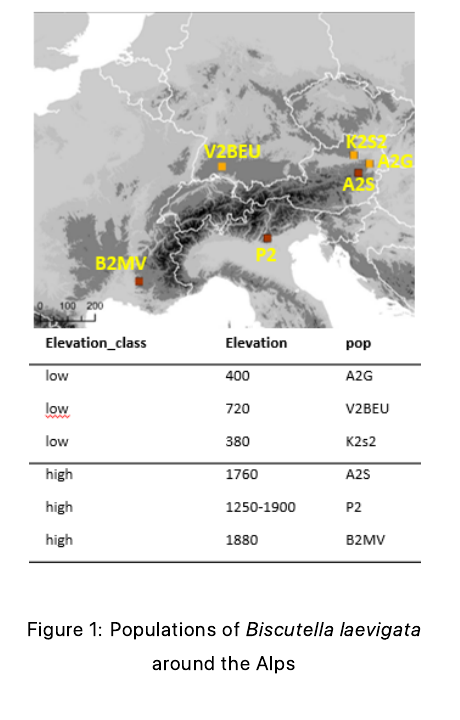

# Practical 3 - Population Structure and Genomic Differentiation in Biscutella

This practical is designed to be run entirely from the RStudio session on Renku.

## Overview

In this practical, you will work with genomic SNP datasets generated from diploid individuals of the alpine plant `Biscutella laevigata`, collected from six natural populations across the Alps: three from low-elevation sites and three from high-elevation sites.

Two types of genomic datasets are provided.

1. ddRADseq dataset: this dataset was produced by reducing genome complexity through double-digest RAD sequencing on 64 individuals and yielded 1,127 SNPs after quality control and pruning of alleles in linkage disequilibrium (LD) > 0.2.
2. Whole-genome sequencing dataset: this dataset is based on resequencing of a subset of 48 individuals and retains 11,475 SNPs after similar filtering for quality and LD (threshold > 0.2).

These datasets are used to investigate population structure, genetic differentiation, and environmental associations using a range of population genomics tools.




You will analyse genomic variation across the six Alpine populations, compare the reduced-representation SNP dataset with the whole-genome SNP dataset, and then zoom in on one scaffold to connect broad population structure with local genomic differentiation.

## Biological context

The dataset includes six populations distributed across the Alps.

- Low-elevation populations: `A2G` (400 m), `V2B` (720 m), `K2S2` (380 m)
- High-elevation populations: `A2S` (1760 m), `P2` (1575 m), `B2MV` (1880 m)

Two SNP datasets are provided.

- ddRAD dataset: 64 individuals and 1,127 LD-pruned SNPs
- WGS dataset: 48 individuals and 11,475 LD-pruned SNPs

The scaffold scan targets the neighbouring populations A2G (low elevation) and A2S (high elevation) to evaluate whether fine-scale genomic differentiation between adjacent populations reflects elevation-associated selection signals.  

## Folder layout

The practical is split into three main folders.

- `Evolutionary-Genomics-UNIFR-2026-SBL.20034/practical3/scripts/`: the three tutorial scripts you open in RStudio
- `dataset-practical3/`: the input files organised into numbered datasets

Create an `outputs/` folder to store the results of your analyses.
```{r, eval=FALSE}
system("mkdir -p work/outputs")
```	

The numbered datasets are:

- `dataset-tutorial3/01-structure-ddrad/`: STRUCTURE input, precomputed runs, reference CLUMPP files, and sample metadata
- `dataset-tutorial3/02-ddrad-wgs-population-comparison/`: ddRAD and WGS VCFs, population distances, and elevation data
- `dataset-tutorial3/03-scaffold1-window-scan/`: scaffold 1 ddRAD and WGS VCFs for the focal `A2G` and `A2S` comparison

## Working in Renku RStudio


Check that you are in the practical root with the following commands in the RStudio console:

```{r, eval=FALSE}
getwd()
setwd("work")
list.files()
system("pwd")
system("ls")
```

You should see folders such as:

- `dataset-tutorial3`
- `Evolutionary-Genomics-UNIFR-2026-SBL.20034`
- `outputs`


## Part 1 - Population Structure from ddRAD SNPs

Dataset folder:

`dataset-tutorial3/01-structure-ddrad/`

Plotting script:

`scripts/01-tutorial-structure-ddrad.Rmd`

### Goal of this part

This part has two stages.

First, you run a very small STRUCTURE analysis yourself from the RStudio console. The purpose is only to understand how a STRUCTURE run is launched and what files it produces.

Second, you switch to the larger precomputed run. That is the run used for StructureHarvester, CLUMPP, the final plots, and the biological interpretation.

### Part 1A - Run a short STRUCTURE example from the RStudio console

The dataset folders are read-only on Renku. Read the input file from `dataset-tutorial3`, but create your parameter files and test outputs in a writable folder under `outputs/`.

Check that you are in the practical root:

```{r, eval=FALSE}
getwd()
list.files()
```

Inspect the STRUCTURE input folder:

```{r, eval=FALSE}
input_dir <- "dataset-tutorial3/01-structure-ddrad/01-structure-input"
setwd(input_dir)
getwd()
list.files()
```

Now create a writable folder for your test run and move there:

```{r, eval=FALSE}
setwd("/home/rstudio/work")
dir.create("outputs/01-structure-ddrad/small_structure_example", recursive = TRUE, showWarnings = FALSE)
setwd("outputs/01-structure-ddrad/small_structure_example")
getwd()
```

Copy the STRUCTURE input file into this writable folder:

```{r, eval=FALSE}
file.copy(
	from = "/home/rstudio/work/dataset-tutorial3/01-structure-ddrad/01-structure-input/diploids_filt1rm_biSNPs_minDP15maxDP130nc_MAF005rm_MD02_pruned02_structure",
	to = ".",
	overwrite = TRUE
)

list.files()
```

The main input file is:

`diploids_filt1rm_biSNPs_minDP15maxDP130nc_MAF005rm_MD02_pruned02_structure`

This file contains the ddRAD SNP data in STRUCTURE format.

It contains genotypic data from 64 diploid individuals scored at 1,127 genetic loci, each represented here as a biallelic SNP.

How the file is organised:

- first row: marker names, with one locus name per column
- following rows: genotype data, with each individual represented by two consecutive rows, one for each chromosome copy; for 64 diploid individuals, that means 128 genotype rows
- first column: the individual ID, repeated on both rows for that sample so you can track which two rows belong to the same individual

A simplified example looks like this:

```text
ID   Locus1 Locus2 ... Locus1127
Ind1 1      2      ... 3
Ind1 1      3      ... 2
Ind2 2      2      ... 4
Ind2 2      3      ... 1
```

How to read the genotype codes:

- alleles are coded as integers such as `1`, `2`, `3`, or `4`
- These numbers represent different alleles at each locus.
- For example, 1 might represent allele A, 2 might represent allele T, and so on.
- missing genotype data are coded as `-9`

What is not included here:

- no extra metadata columns are included after the genotype columns
- in other STRUCTURE datasets, you could add population of origin, sampling location, or similar metadata if the corresponding analysis settings expected them
- in this practical dataset, clustering is run without those extra columns

Create a short `mainparams` file for a small run:

```{r, eval=FALSE}
writeLines(
	c(
		"#define INFILE diploids_filt1rm_biSNPs_minDP15maxDP130nc_MAF005rm_MD02_pruned02_structure",
		"#define OUTFILE small_run",
		"#define NUMINDS 64",
		"#define NUMLOCI 1127",
		"#define POPDATA 0",
		"#define POPFLAG 0",
		"#define PHENOTYPE 0",
		"#define EXTRACOLS 0",
		"#define MISSING -9",
		"#define PLOIDY 2",
		"#define LABEL 1",
		"#define MARKERNAMES 1",
		"#define BURNIN 10000",
		"#define NUMREPS 20000"
	),
	con = "mainparams"
)
```
These are the core mainparams that define the scale and format of a STRUCTURE run. `NUMINDS 64` and `NUMLOCI 1127` tell STRUCTURE the dimensions of the dataset: 64 individuals genotyped at 1,127 loci. `PLOIDY 2` specifies that each individual is diploid, so STRUCTURE expects two alleles per locus. `LABEL 1` and `MARKERNAMES 1` indicate that the input file includes individual labels and locus names as headers. `MISSING -9` defines the code used to represent missing genotype data. `POPDATA 0` and `POPFLAG 0` mean no prior population assignments are provided, so clustering is performed entirely without supervision. `PHENOTYPE 0` and `EXTRACOLS 0` confirm there are no additional phenotype or extra data columns in the input file. Finally, `BURNIN 10000` and `NUMREPS 20000` set the MCMC schedule: the first 10,000 iterations are discarded as burn-in to allow the chain to converge, and the subsequent 20,000 iterations are used to estimate the posterior distributions of Q-values and allele frequencies.  

Create a short `extraparams` file:

```{r, eval=FALSE}
writeLines(
	c(
		"#define NOADMIX 0           # Allow admixture",
		"#define LINKAGE 0           # Assume independent loci",
		"#define USEPOPINFO 0        # Unbiased clustering",
		"#define LOCISPOP 0          # Global population info (not per-locus)",
		"",
		"#define INFERALPHA 1        # Infer alpha from data",
		"#define FREQSCORR 1         # Model allele frequency correlation",
		"",
		"#define COMPUTEPROB 1       # Enable Evanno K selection",
		"#define PRINTNET 1          # Output net distances",
		"#define PRINTQHAT 1         # Output ancestry proportions",
		"",
		"#define UPDATEFREQ 5000     # Output frequency",
		"#define RANDOMIZE 0         # Deterministic parameter updates"
	),
	con = "extraparams"
)
```

These parameters configure STRUCTURE to perform **unbiased population clustering with standard statistical outputs**. Setting `NOADMIX 0` activates the admixture model, which allows each individual to draw a proportion of their ancestry from multiple clusters. `LINKAGE 0` tells STRUCTURE to treat all loci as statistically independent, which is the correct assumption here because our input SNPs have already been LD-pruned. `USEPOPINFO 0` and `LOCISPOP 0` tell STRUCTURE to discover population structure *de novo* without being guided by metadata; the algorithm finds clusters purely from genetic similarity. `INFERALPHA 1` allows STRUCTURE to learn the Dirichlet parameter alpha from the data itself, while `FREQSCORR 1` models realistic genetic differentiation between clusters by allowing allele frequencies to vary systematically across populations. `COMPUTEPROB 1` calculates the likelihood P(data|K) required for the Evanno Delta K method to select optimal K, `PRINTNET 1` outputs pairwise genetic distances between clusters, and `PRINTQHAT 1` outputs ancestry proportions for each individual. Finally, `UPDATEFREQ 5000` specifies how often allele frequencies are updated during the MCMC chain (every 5000 steps), and `RANDOMIZE 0` ensures parameters are updated in deterministic order for reproducible results across runs, promoting convergence stability.  

Make a folder for the test outputs:

```{r, eval=FALSE}
dir.create("small_structure_runs", showWarnings = FALSE)
```

Run a short example with a few values of `K` and a few replicates:

```{r, eval=FALSE}
jobs <- expand.grid(K = 1:4, REP = 1:3)

parallel::mclapply(
	seq_len(nrow(jobs)),
	function(i) {
		system(
			sprintf(
				"structure -K %d -m mainparams -e extraparams -o small_structure_runs/run_K%d_rep%d",
				jobs$K[i], jobs$K[i], jobs$REP[i]
			)
		)
	},
	mc.cores = 4
)
```

What you are doing here:

- `K` is the number of genetic clusters tested by STRUCTURE
- each replicate is one independent MCMC run
- replicates are needed because repeated Bayesian runs can converge slightly differently
- `mc.cores = 4` means that up to four STRUCTURE runs are launched in parallel

Inspect the output files:

```{r, eval=FALSE}
system("ls small_structure_runs")
```

You should see files ending in `_f`. These are the main STRUCTURE result files.

At this point, stop using the small run for downstream analysis.

The small run is only there so you understand what a STRUCTURE command looks like and what kind of output files it creates.

### Part 1B - Move to the real precomputed STRUCTURE run

Return to the practical root before continuing with the precomputed run:

```{r, eval=FALSE}
setwd("/home/rstudio/work")
getwd()
```

In the previous steps, you ran STRUCTURE using a smaller number of replicates, with relatively short burnin and MCMC lengths. This was meant to help you understand how the software works and to check that everything runs correctly. However, to obtain reliable and robust results, STRUCTURE should be run for
more replicates and with longer chains.  
To save time, weʼve already done this for you: we ran STRUCTURE with 10 independent chains for each K value from K = 1 to K = 6, using a burn-in period of 100,000 iterations followed by 1,000,000 MCMC iterations. You can now use these precomputed STRUCTURE outputs to carry out the final steps of your analysis.  

The real analysis runs are already provided in:

`dataset-tutorial3/01-structure-ddrad/02-precomputed-structure-runs/ddRAD_results/`


Go to that folder in the RStudio console:

```{r, eval=FALSE}
setwd("dataset-tutorial3/01-structure-ddrad/02-precomputed-structure-runs")
list.files()
setwd("ddRAD_results")
list.files()
```

### Part 1C - Run StructureHarvester on the real precomputed run

Still in the RStudio console, run:

```{r, eval=FALSE}
setwd("/home/rstudio/work")
dir.create("outputs/01-structure-ddrad", recursive = TRUE, showWarnings = FALSE)
system(
	paste(
		"structureHarvester.py",
		"--dir /home/rstudio/work/dataset-tutorial3/01-structure-ddrad/02-precomputed-structure-runs/ddRAD_results",
		"--out /home/rstudio/work/outputs/01-structure-ddrad/structureHarvester_analysis",
		"--evanno --clumpp"
	)
)
```

What StructureHarvester does:

- it reads all the STRUCTURE replicate files
- it summarizes likelihood values across replicates
- it calculates the Evanno statistics used to compare values of `K`
- it prepares CLUMPP input files when `--clumpp` is used

Inspect the output folder:

```{r, eval=FALSE}
system("ls /home/rstudio/work/outputs/01-structure-ddrad/structureHarvester_analysis")
```

Important files include:

- `summary.txt`
- `evanno.txt`
- `.indfile` files prepared for CLUMPP

### Part 1D - Run CLUMPP on the real precomputed run

Move into the StructureHarvester output folder and inspect the CLUMPP input files:

```{r, eval=FALSE}
setwd("/home/rstudio/work/outputs/01-structure-ddrad/structureHarvester_analysis")
system("ls *.indfile")
```

The CLUMPP paramfile provided with the practical is in:

`dataset-tutorial3/01-structure-ddrad/03-reference-clumpp-files/`

Copy the `paramfile` into the current folder. It specifies the parameters for CLUMPP, such as the number of clusters (K), the number of replicates, the number of individuals, and the input and output file names. Most of these parameters will be overridden by the command-line arguments when you run CLUMPP, but the `paramfile` serves as a template for how to structure your CLUMPP runs.

```r
file.copy(
	from = "/home/rstudio/work/dataset-tutorial3/01-structure-ddrad/03-reference-clumpp-files/paramfile",
	to = ".",
	overwrite = TRUE
)
```

One typical way to run CLUMPP is to loop across values of `K`:

```{r, eval=FALSE}
REPS <- 10
INDS <- 64

for (K in 2:6) {
	OUTFILE <- sprintf("clumpp_output_%d.txt", K)
	system(
		sprintf(
			"CLUMPP -k %d -r %d -c %d -i K%d.indfile -o %s -j K%d.miscfile",
			K, REPS, INDS, K, OUTFILE, K
		)
	)
}
```

Here:

- `-k` is the number of clusters
- `-r` is the number of STRUCTURE replicates being aligned
- `-c` is the number of individuals
- `-i` is the CLUMPP input file prepared by StructureHarvester
- `-o` is the aligned output membership file
- `-j` is the CLUMPP miscellaneous output file


### Part 1E - Make the final plots in R

Now return to RStudio and run:

`scripts/01-tutorial-structure-ddrad.Rmd`

### What the plotting script does

The script does not rerun STRUCTURE. Instead, it reads the summary files you already prepared with StructureHarvester and CLUMPP, then turns them into figures.

It will:

- read the Evanno summary for `K = 1` to `K = 6`
- decide which value of `K` is best supported
- read the aligned CLUMPP membership coefficients for the `K` you chose
- make a Switzerland-referenced map with population coordinates and mean admixture proportions
- combine those ancestry coefficients with the sample coordinates
- draw the ancestry plots used in class discussion

### How to run the plotting script in RStudio

1. Make sure your working directory is the practical root, i.e. inside the `work/` folder.
2. Open `scripts/01-tutorial-structure-ddrad.Rmd`.
3. Run the model-choice chunks first and inspect `structure_model_choice.png`.
4. In the `choose-best-k` chunk, fill in the value of `best_k` that you infer from the model-choice figure. Choose the best K based on the Evanno method (Evanno et al 2005), where delta K reaches its highest peak.
5. Run the remaining chunks to draw the ancestry barplot and population map for your chosen `K`.


### Expected outputs

The script writes to `outputs/01-structure-ddrad/` and creates:

- `population_sampling_map.png`
- `structure_model_choice.png`
- `structure_evanno_summary.tsv`
- `structure_k4_membership.tsv` if you set `best_k <- 4`
- `structure_k4_barplot.png` if you set `best_k <- 4`

### How to read the figures

- `population_sampling_map.png`: shows the six population coordinates over a Switzerland reference map, with a pie chart for the mean ancestry proportion of each population
- `structure_model_choice.png`: shows how support changes across values of `K`; inspect this first, then write your chosen value into the `best_k` chunk of the notebook
- `structure_k4_barplot.png`: each bar is one individual; the colored fractions show the estimated ancestry membership in each cluster when `best_k <- 4`

### Questions to think about
1. Describe the observed spatial genetic structure based on your analysis of ddRADseq data.
2. How do field populations relate to genetically-delineated populations?
3. Are genetic clusters geographically consistent?
4. Explain the pattern observed in the North of the Alps (e.g. field population V2BEU)?
5. Which populations appear genetically homogeneous?
6. Does the spatial arrangement of populations help explain the ancestry pattern?
7. Which value did you choose for `best_k`, and does the ancestry plot for that `K` support the same interpretation?

## Part 2 - PCA, Pairwise Fst, IBD, and IBE

Dataset folder:

`dataset-practical3/02-ddrad-wgs-population-comparison/`

Script:

`scripts/02-tutorial-ddrad-wgs-comparison.Rmd`

### What this script does

This script asks whether ddRAD and WGS tell the same broad biological story.

It does this in three ways:

- PCA: asks whether individuals cluster similarly in the two datasets
- pairwise `Fst`: asks which populations are most differentiated
- Mantel tests: ask whether genetic differentiation is associated with geography, elevation, or both

This clean version also adds three simple extension analyses:

- observed heterozygosity by population
- a ddRAD versus WGS pairwise `Fst` correlation scatterplot
- PCA plots with population centroids

### How to run it in RStudio

1. Make sure your working directory is the practical root.
2. Open `scripts/02-tutorial-ddrad-wgs-comparison.Rmd`.
3. Run the script.

### Expected outputs

The script writes to `outputs/02-ddrad-wgs-population-comparison/` and creates:

- `pca_overview.png`
- `pca_population_centroids.png`
- `pairwise_fst_heatmaps.png`
- `population_heterozygosity.png`
- `population_heterozygosity.tsv`
- `ddrad_vs_wgs_fst_correlation.png`
- `ddrad_vs_wgs_fst_pairs.tsv`
- `mantel_relationships.png`
- `ddrad_pca_explained_variance.tsv`
- `wgs_pca_explained_variance.tsv`
- `ddrad_pairwise_fst.tsv`
- `wgs_pairwise_fst.tsv`
- `geographic_distance_matrix.tsv`
- `elevation_distance_matrix.tsv`
- `mantel_test_summary.tsv`

### How to read the figures

- `pca_overview.png`: each point is one individual; compare whether ddRAD and WGS separate the populations in similar ways
- `pca_population_centroids.png`: the larger cross-shaped marks show the average PCA position of each population, which makes the population-level pattern easier to read
- `pairwise_fst_heatmaps.png`: darker values mean stronger genetic differentiation between populations
- `population_heterozygosity.png`: compares within-population diversity across populations and between ddRAD and WGS
- `ddrad_vs_wgs_fst_correlation.png`: asks whether the two marker systems rank pairwise population differentiation similarly
- `mantel_relationships.png`: each point is one pair of populations; the plots ask whether distance or elevation contrast is associated with stronger differentiation

### Questions to think about

1. Do ddRAD and WGS recover the same broad population structure?
2. Which populations are consistently differentiated in both datasets?
3. Does WGS reveal finer separation than ddRAD?
4. Is the genetic pattern better explained by geography, elevation, or both?
5. Which populations show the highest or lowest heterozygosity?
6. Do ddRAD and WGS agree on which population pairs are most differentiated?

## Part 3 - Sliding-Window Differentiation Along Scaffold 1

Dataset folder:

`dataset-practical3/03-scaffold1-window-scan/`

Script:

`scripts/03-tutorial-scaffold1-window-scan.Rmd`

### What this script does

This script zooms in on scaffold 1 for the neighbouring populations `A2G` and `A2S`.

It calculates:

- sliding-window `Fst`
- within-population nucleotide diversity (`pi`)
- between-population divergence (`Dxy`)
- Tajima's D for each population and for the combined dataset

Reading these statistics together helps you decide whether a peak is only a relative differentiation signal or whether it is also a strong absolute divergence signal.

### How to run it in RStudio

1. Make sure your working directory is the practical root.
2. Open `scripts/03-tutorial-scaffold1-window-scan.Rmd`.
3. Run the script.

### Expected outputs

The script writes to `outputs/03-scaffold1-window-scan/` and creates:

- `wgs_scaffold1_window_stats.tsv`
- `ddrad_scaffold1_window_stats.tsv`
- `wgs_scaffold1_summary.png`
- `ddrad_scaffold1_summary.png`
- `ddrad_vs_wgs_fst.png`


### Questions to think about

1. Are the major `Fst` peaks shared between ddRAD and WGS?
2. Do those peaks coincide with low `pi`, high `Dxy`, both, or neither?
3. Does WGS reveal a clearer pattern than ddRAD?

